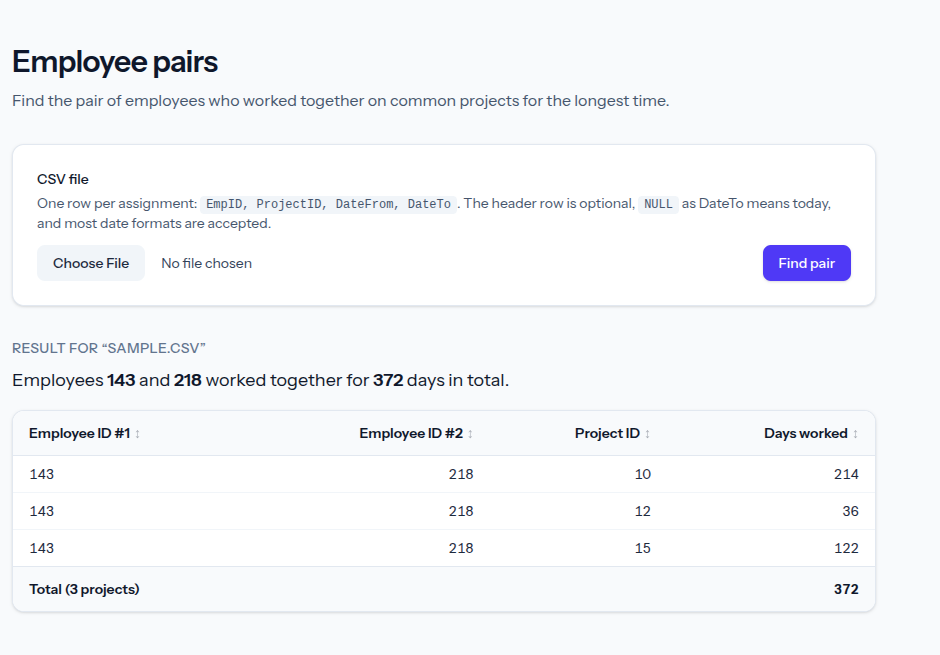

# Employees who worked together the longest — Petar Kolitsov

A Laravel application that reads a CSV file of project assignments
(`EmpID, ProjectID, DateFrom, DateTo`) and finds the **pair of employees who worked
together on common projects for the longest time**. Two employees worked together
when they have periods on the same project that overlap; the pair's score is the
sum of those overlapping days across all their common projects.

```
143, 218, 372        <- EmpID1, EmpID2, TotalDaysTogether
```

## Requirements checklist

| Requirement | Status |
|---|---|
| Find the pair of employees who worked together on common projects the longest | ✅ |
| `DateTo = NULL` means today | ✅ |
| Input data loaded from a CSV file | ✅ |
| Repository named `{FirstName}-{LastName}-employees` | ✅ |
| Bonus 1: UI with a file picker and a datagrid (`Employee ID #1`, `Employee ID #2`, `Project ID`, `Days worked`) | ✅ |
| Bonus 2: multiple date formats | ✅ ([full list](#supported-date-formats)) |

## Features

- **Core:** CSV input, `DateTo = NULL` means today, result in the `EmpID1, EmpID2, TotalDaysTogether` format.
- **Bonus 1: web UI.** Pick a file (it's analysed as soon as you choose it) to see the winning pair and a
  datagrid of **all their common projects** (`Employee ID #1`, `Employee ID #2`, `Project ID`,
  `Days worked`) with a total row. Click any column header to sort by it.
- **Bonus 2: date formats.** Numbers and month names in any order and with any separator, month and
  weekday names in 12 languages, two-digit years, times and time zones, Unix timestamps. The order of
  ambiguous dates like `01/02/2013` is detected from the file. See the [full list](#supported-date-formats).
- **Console command:** `php artisan employees:longest-pair file.csv [--details]`.
- **Robust CSV reading:** optional header, auto-detected `,` `;` or tab delimiter, UTF-8 BOM,
  UTF-16 (Excel "Unicode text"), CRLF, blank lines, quoted values, streaming. Invalid rows are skipped
  with line-numbered warnings.



## Run with Docker

```bash
docker compose up --build
```

Open <http://localhost:8000>. An app key is generated automatically. No database is used.

Run the console command inside the container (the sample files are included in the image):

```bash
docker compose exec app php artisan employees:longest-pair samples/sample.csv
```

Stop the app with `docker compose down`.

## Run locally

Requirements: PHP 8.4+, Composer, Node.js 20+ and npm.

```bash
composer install
cp .env.example .env
php artisan key:generate
npm install && npm run build
php artisan serve
```

Open <http://localhost:8000>. The app accepts files up to 20 MB, but local PHP also applies its own
limits: `upload_max_filesize` and `post_max_size` (often 2 MB and 8 MB by default) must be at least
20M/21M, and the largest files need `memory_limit` of about 256M (a realistic 20 MB file of about
570,000 rows peaks at about 210 MB). The Docker image already sets all three.

## Console usage

```bash
$ php artisan employees:longest-pair samples/sample.csv
143, 218, 372

$ php artisan employees:longest-pair samples/sample.csv --details
143, 218, 372

+----------------+----------------+------------+-------------+
| Employee ID #1 | Employee ID #2 | Project ID | Days worked |
+----------------+----------------+------------+-------------+
| 143            | 218            | 10         | 214         |
| 143            | 218            | 12         | 36          |
| 143            | 218            | 15         | 122         |
+----------------+----------------+------------+-------------+
| Total          |                |            | 372         |
+----------------+----------------+------------+-------------+
```

- Only the result (and the `--details` table) goes to **stdout**; warnings about skipped rows, the
  note about [ambiguous dates](#how-ambiguous-dates-are-resolved) and errors go to **stderr**, so
  `... 2>/dev/null` prints just the result line.
- Exit code `0` on success (also when no pair overlapped), `1` when the file is missing, unreadable,
  empty or has no valid rows.

## Tests

Run the tests locally (the Docker image is built without development dependencies):

```bash
php artisan test
./vendor/bin/pint --test
```

Unit tests cover `DateParser`, `CsvEmployeeReader` and `EmployeePairFinder`; feature tests cover the
upload page, validation, the console command and every sample file. "Today" is frozen in tests.

## CSV format and sample files

```
EmpID, ProjectID, DateFrom, DateTo
143, 12, 2013-11-01, 2014-01-05
218, 10, 2012-05-16, NULL
```

| File | What it shows | Result |
|---|---|---|
| `samples/sample.csv` | The assignment rows plus more; the winner has 3 common projects (214 + 36 + 122 days). The runner-up (143, 301) has 365 days on a single project. | `143, 218, 372` |
| `samples/mixed-date-formats.csv` | The same data written in many date formats, quoted values, `NULL`/`null`/empty DateTo | `143, 218, 372` |
| `samples/with-errors.csv` | 7 invalid rows (text ID, missing column, bad/impossible date, DateFrom after DateTo, missing DateFrom), reported as warnings | `1, 2, 17` |
| `samples/no-overlap.csv` | Nobody overlaps | "No pair of employees worked together..." |
| `samples/us-dates.csv` | US dates (`03/01/2014` is March 1); `12/31/2014` proves the file is month-first. Read day-first, the winner would be `30, 40, 124`. | `10, 20, 68` |

The results don't depend on the current date: in these files, no two open-ended (`NULL`) periods share a project.

### Supported date formats

| Kind | Examples |
|---|---|
| ISO 8601 | `2013-11-01`, `2013-11-01T10:00:00Z`, `2013-11-01 10:00:00`, `2013-11-01T10:00:00.000+02:00`, `20131101` |
| Year first | `2013/11/01`, `2013.11.01`, `2013-11-1`, `2013 11 01` |
| Day/month first | `01/11/2013`, `11/13/2013`, `01.11.2013`, `01-11-2013`, `01 11 2013`, `11/01/2013 10:00 AM` ([order](#how-ambiguous-dates-are-resolved)) |
| Two-digit years | `01/11/13`, `01.11.13`, `01-NOV-13` (`00`–`69` → 2000s, `70`–`99` → 1900s) |
| Month names | `1 Nov 2013`, `01-Nov-2013`, `Nov. 1, 2013`, `November 1st, 2013`, `01Nov2013`, `01 Nov, 2013`, `2013 Nov 1`, `Sept 1, 2013` |
| Bulgarian | `1. 11. 2013`, `01.11.2013 г.`, `1 ноември 2013 г.`, `01-ное-2013` |
| Other languages | `1 de noviembre de 2013`, `1. November 2013`, `1 novembre 2013`, `1 listopada 2013`, `1 ноября 2013` |
| With weekday | `Friday, November 1, 2013`, `Fri, 01 Nov 2013 10:00:00 +0000`, `петък, 1 ноември 2013` (the weekday must match the date) |
| Web server log | `01/Nov/2013:10:00:00 +0000` |
| Unix timestamp | `1383264000` (seconds) or `1383264000000` (milliseconds), read as UTC |
| No end date | `NULL`, `null`, empty value → today (DateTo only) |

Only the calendar date is used; times and time zones are ignored. Dates that are not numbers only are
split into numbers and words: every word must be a month name, a weekday or one of a few filler words
(`г`, `год`, `година`, `de`, `del`, `of`, `the`), so unknown words are rejected. Impossible dates such as
`2013-02-30` are rejected rather than rolled over. Not supported: relative or incomplete dates
(`tomorrow`, `Nov 2013`), ISO week dates (`2013-W44-5`), day-of-year dates (`2013-305`) and Chinese,
Japanese or Korean dates.

**Month and weekday names** are recognised in English, Bulgarian, German, French, Spanish, Italian,
Portuguese, Dutch, Russian, Polish, Romanian and Turkish, including short and genitive forms (Russian
`ноября`, Polish `listopada`). The names come from Carbon's translation files. To change the languages,
edit `month_name_locales` in `config/employees.php` (Carbon locale codes). A word that means different
months in two enabled languages is ignored, and a word that is both a month and a weekday (`mar`) is read
as the month.

### How ambiguous dates are resolved

A date like `01/02/2013` can be 1 February or 2 January. Before reading the rows, the app scans the
whole file: a date like `25/02/2013` proves the file is day-first, and `02/25/2013` proves it is
month-first. If the file only proves one order, all its ambiguous dates are read that way. With no
evidence, or with both kinds (as in `samples/mixed-date-formats.csv`), the configured default is used
(day-first). The UI and the console say which order was used and why, for example
*"Ambiguous dates like 03/01/2014 were read as month-first (detected from line 6: 12/31/2014)."*

## Assumptions and decisions

- **Inclusive day counting:** both the first and the last day count, so two employees on the same
  project on the same single day worked together for **1 day**. Switch with
  `EmployeePairFinder::COUNT_DAYS_INCLUSIVE`. With exclusive counting the sample result would be
  `143, 218, 369` (one day less per common project).
- **NULL = today:** `NULL` (any case) or an empty DateTo means today (from Carbon's clock, frozen in
  tests). DateFrom is required.
- **Ambiguous dates are detected from the file, day-first by default:** see
  [How ambiguous dates are resolved](#how-ambiguous-dates-are-resolved). A date where one number is
  above 12 is always read the only valid way. Change the default with
  `EMPLOYEES_AMBIGUOUS_DATE_ORDER=month_first` (`config/employees.php`).
- **Repeated periods are merged:** if an employee has several overlapping or back-to-back records on
  the same project, they are merged first, so no day is counted twice. Separate periods (left and came
  back) all count.
- **Tie-break:** when several pairs share the highest total, the pair with the lowest `EmpID1` wins,
  then the lowest `EmpID2`. The UI and the console mention the tie.
- **Pairs are unordered** and always shown with the smaller ID first; an employee is never paired with
  themselves.
- **Invalid rows are skipped** with warnings (`Line 7: invalid date 'abc'`). The file is rejected only
  if it is empty or has no valid rows.
- **The header is optional:** the first row is treated as the header only when none of its values look
  like data (EmpID and ProjectID are not numbers and DateFrom is not a date). An invalid first data row
  is reported as a warning like any other row.
- **No database or storage:** the uploaded temp file is read directly and never saved.

## Architecture

| Class | Responsibility |
|---|---|
| `App\Services\DateParser` | Turns a date string into a date: fast paths for timestamps and numeric dates, then tokens (numbers, month and weekday names). Knows NULL → today and what a value proves about the day/month order. Immutable. |
| `App\Services\DateNames` | Month and weekday names in the enabled languages, built once from Carbon's translation files. |
| `App\Services\DateCache` | Per-file cache of parsed dates (as day numbers), at most 5,000 distinct values. |
| `App\Services\CsvEmployeeReader` | Streams the CSV with `fgetcsv`: a first pass detects the date order, the second validates rows (header, delimiter, BOM) → `CsvReadResult` (records, warnings, `DateOrderDetection`). |
| `App\Services\EmployeePairFinder` | Pure calculation (no I/O, no framework): records → `PairResult` or `null`. |
| `App\DTO\*` | Readonly DTOs: `EmployeeRecord`, `ProjectOverlap`, `PairResult`, `CsvReadResult`, `DateOrderDetection` (order used, reason, proving line). |
| `App\Http\Controllers\EmployeePairController` | Thin: validated upload → reader → finder → view. |
| `App\Http\Requests\UploadCsvRequest` | File required, not empty, `.csv`/`.txt`, plain text, max 20 MB. |
| `App\Console\Commands\FindLongestPairCommand` | `employees:longest-pair` console command. |
| `resources/views/employees/*`, `resources/js/app.js` | Blade + Tailwind page; small vanilla JS for auto-submit and column sorting. |

### Algorithm

1. **Group** the records by project, then by employee (dates are stored as day numbers, which keeps
   memory low for large files).
2. **Merge** each employee's overlapping or adjacent periods on a project into disjoint periods.
3. For each project, for **every two employees** on it (smaller ID first), add up the overlap of
   their periods: `start = max(from1, from2)`, `end = min(to1, to2)`, and if `start <= end` the overlap
   is `end - start + 1` days.
4. **Accumulate** a running total per pair, then pick the pair with the highest sum (tie-break above).
   The per-project days are then recalculated for the winning pair only; they become the datagrid
   rows, so the rows always add up to the total.

Employees are only compared within a project, so the cost grows with the number of people per
project, not with the size of the whole file.
